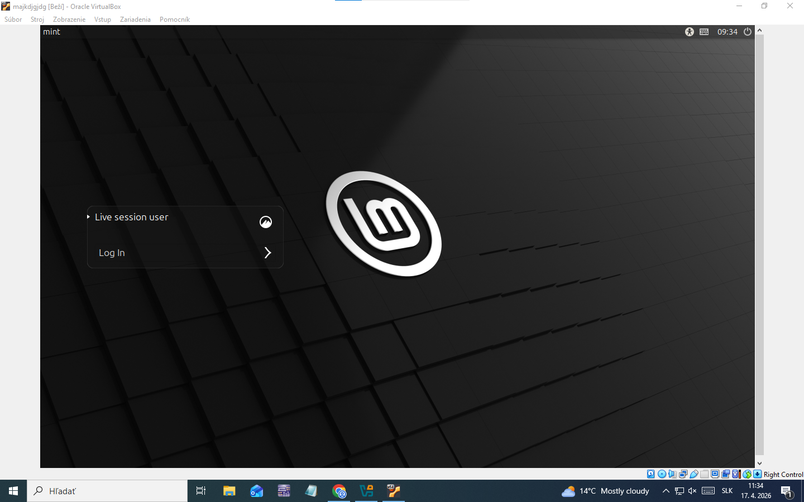

# Cvičenie: Linux — základy, GNU/GPL a distribúcie

> Vyplň odpovede pod každú otázku. Pri otázkach typu áno/nie zaškrtni `- [x]`. Výstupy z terminálu prilep do code blokov.

---

## Úloha 1 — Pojmy GNU a GPL

### 1.1 Rozdiel „free as in freedom" vs. „free as in beer"

**free as in freedom:**  
Sloboda používať, upravovať a šíriť softvér. Ide o práva používateľa, nie o cenu.

**free as in beer:**  
Softvér je zadarmo (bezplatný), ale nemusí byť slobodný – nemusíš mať prístup k zdrojovému kódu ani právo ho meniť.

---

### 1.2 Čo znamená skratka GPL (celý anglický názov)?

**GNU General Public License**

---

### 1.3 Prečo sa Linux niekedy označuje ako „GNU/Linux" a nielen „Linux"?

Pretože samotný Linux je len jadro (kernel). Celý operačný systém obsahuje množstvo nástrojov z projektu GNU, ktoré tvoria väčšinu systému (napr. shell, príkazy, knižnice). Preto je presnejšie označenie GNU/Linux.

---

## Úloha 2 — Práca s distrowatch.com

### 2.1 Na akej distribúcii je postavený Linux Mint?

Linux Mint je postavený na **Ubuntu** (a nepriamo na Debiane).

---

### 2.2 Poradie Linux Mint v rebríčku „Page Hit Ranking — Last 6 months"

- **Poradie:** 2
- **Hodnota:** 2385

---

### 2.3 Distribúcia z inej rodiny ako Debian

| Položka | Tvoja odpoveď |
|---|---|
| Názov distribúcie | Fedora |
| Rodina (Red Hat / Arch / SUSE / iná) | Red Hat |
| Balíčkovací systém (apt / dnf / pacman / zypper / iný) | dnf |

---

## Úloha 3 — Prihlásenie a odhlásenie

### 3.1 Aká obrazovka sa zobrazila po odhlásení? Čo si na nej videl?

Zobrazila sa prihlasovacia obrazovka (login screen), kde bolo možné vybrať používateľa

---

### 3.2 Bola plocha po opätovnom prihlásení rovnaká, alebo „čistá" (zatvorené všetky okná)?

- [ ] rovnaká ako predtým
- [x] čistá (nové okná)

---

## Úloha 4 — Tri spôsoby spustenia konzoly

### 4.1 Menu → Terminal

Aký je presný názov aplikácie v záhlaví okna?

mint@mint

---

### 4.2 Klávesová skratka `Ctrl + Alt + T`

Otvoril sa rovnaký program ako v 4.1?

- [x] áno
- [ ] nie

---

### 4.3 TTY (`Ctrl + Alt + F3`)

**Aspoň 2 rozdiely medzi TTY a grafickým terminálom:**

1. TTY nemá grafické rozhranie (iba text), zatiaľ čo terminál beží v GUI.  
2. TTY funguje nezávisle od grafického prostredia, terminál je jeho súčasťou.

**Cez ktoré F-tlačidlo si sa vrátil späť do GUI?**

- [ ] F1
- [ ] F2
- [ ] F7
- [x] iné:

---

## Úloha 5 — Čítanie promptu

### 5.1 Výstupy príkazov
$ whoami:
mint

$ hostname:
mint

$ pwd:
/home/mint

$ echo $USER:
mint
```

### 5.2 Aký znak je na konci tvojho promptu?

- [x] `$`
- [ ] `#`

---

### 5.3 Čo tento znak hovorí o tvojich právach v systéme?

Znak `$` znamená, že si bežný používateľ (nie administrátor).  
Znak `#` by znamenal root (plné práva).

---

### 5.4 Čítanie promptu

Pozri sa na svoj prompt (príklad: `andrej@mint:~$`). Vypíš, čo všetko z neho vieš prečítať **bez napísania jediného príkazu**:

- meno používateľa  
- názov počítača  
- aktuálny priečinok  
- typ používateľa (bežný/root)  

---

## Záver

Čo bolo pre teba dnes nové alebo zaujímavé?

- to ako sa da robit s virtualnym os