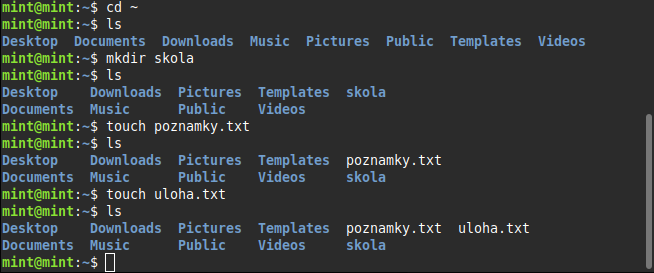
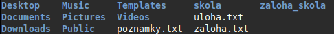
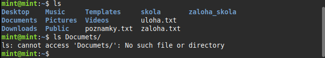

# Cvičenie: Príkazový riadok OS — `ls`, `cd`, `cp`, `rm`, `mv`

> Vyplň odpovede pod každú otázku. Pri otázkach typu áno/nie zaškrtni `- [x]`. Výstupy z terminálu prilep do code blokov.

---

## Úloha 1 — Orientácia v systéme

> Otvor terminál (`Ctrl + Alt + T`). Všetky nasledujúce príkazy píš v **tvojom domove**.

### 1.1 Napíš `pwd` a zapíš výstup (absolútna cesta k tvojmu domovu):
/home/mint
```
/home/mint
```

### 1.2 Napíš `ls`. Vymenuj aspoň **3 položky**, ktoré vidíš:

-Desktop
-Documents
-Download

### 1.3 Napíš `ls -l`. Nájdi:

- **Jeden priečinok** (začína `d`):desktop
- **Jeden súbor** (začína `-`):ziadny

### 1.4 Napíš `ls -a`. Zapíš aspoň **3 skryté položky** (začínajú `.`):

-config
-local
-profile

---

## Úloha 2 — Navigácia po strome

> Po každom kroku napíš **čo ti ukázal `pwd`**.

### 2.1 Spusti `cd ~`, potom `pwd`:

```
/home/mint
```

### 2.2 Spusti `cd ..`, potom `pwd`:

```
/home
```

> **Pozor:** správna odpoveď je `/home` (nie `/home/<tvoje_meno>`). Ak máš niečo iné, nerozumel si `..`.

### 2.3 Spusti `cd /`, potom `pwd`:

```
/
```

### 2.4 Spusti `cd -`. Čo ti vypíše shell na obrazovku?

```
/home
```

### 2.5 Ako sa najrýchlejšie vrátiš do svojho domovského adresára? Napíš **dva spôsoby**:

1.cd ~
2.cd

---

## Úloha 3 — Kopírovanie

> Postupne vykonaj nasledujúce príkazy. Po každom skontroluj výsledok cez `ls`.

### 3.1 Vytvor štruktúru:

```bash
cd ~
mkdir skola
touch poznamky.txt
touch uloha.txt
```

Napíš výstup `ls` po týchto príkazoch:





### 3.2 Skopíruj súbor do priečinka:

```bash
cp poznamky.txt skola/
```

Napíš výstup `ls skola/`:

```
poznamky.txt
```

### 3.3 Duplikuj súbor pod novým menom:

```bash
cp poznamky.txt zaloha.txt
```

Existuje teraz aj **originál** `poznamky.txt`, aj **kópia** `zaloha.txt`?

- [x] áno
- [ ] nie

### 3.4 Skús skopírovať priečinok **BEZ** `-r`:

```bash
cp skola zaloha_skola
```

**Presná chybová hláška:**

```
cp: -r not specified; ommiting directory 'skola'
```

### 3.5 Teraz s `-r`:

```bash
cp -r skola zaloha_skola
```

Napíš výstup `ls`:




### 3.6 Prečo `cp` potrebuje `-r` pri priečinkoch?

---lebo priečinok obsahuje ďalšie súbory → treba kopírovať rekurzívne

## Úloha 4 — Premenovanie a presun

### 4.1 Premenuj súbor:

```bash
touch test.txt
mv test.txt hotovo.txt
```

Vidíš ešte `test.txt` v `ls`?

- [ ] áno — ostal
- [x] nie — zmizol (premenovaný)

### 4.2 Presuň do priečinka:

```bash
mv hotovo.txt Documents/
```

Napíš výstupy:

```
$ ls

$ ls Documents/
```



### 4.3 Presuň celý priečinok (**bez** `-r`!):

```bash
mv skola zaloha_skola2
```

Dostal si chybovú hlášku?

- [ ] áno
- [x] nie

### 4.4 Doplň pravidlo:

**`mv` súbor priečinok/** → mv súbor priečinok/(presun / premenovanie)
**`mv` súbor novy_nazov** → mv súbor novy_nazov(presun / premenovanie)

> *Ako `mv` rozozná, ktorú akciu má urobiť?*
podľa toho, či cieľ existuje ako priečinok
---

## Úloha 5 — Mazanie ⚠️

> **Pozor:** v Linuxe **neexistuje Kôš**. Čo zmažeš, je preč.
> **Nepúšťaj** `rm -rf` na nič mimo vlastného testovacieho priečinka.

### 5.1 Zmaž súbor:

```bash
touch zmaz.txt
rm zmaz.txt
```

Existuje ešte `zmaz.txt` v `ls`?

- [ ] áno
- [x] nie

### 5.2 Skús zmazať priečinok **BEZ** `-r`:

```bash
rm zaloha_skola
```

**Presná chybová hláška:**

```
rm: cannot remove 'zaloha_skola': Is a directory
```

### 5.3 Teraz s `-r`:

```bash
rm -r zaloha_skola
```

Napíš výstup `ls` po zmazaní:


### 5.4 Kde skončí vymazaný súbor v Linuxe?
Nikde. Súbor je okamžite zmazaný (žiadny kôš)
> *(Pozor, otázka s pascou. Pomysli, predtým než odpovieš.)*

### 5.5 Napíš **vlastnými slovami**, prečo je príkaz `rm -rf /` **extrémne nebezpečný**:
zmazal by celý systém
---

## Bonus — tab completion a history

### B.1 Skús napísať `cd Doc` a stlačiť **Tab**. Čo sa stalo?

### B.2 Stlač **šípku hore** v termináli. Čo sa stalo?

### B.3 Napíš **tvoj obľúbený objav** z dnešnej hodiny (príkaz, skratka, trik):

---

## Záver

Ktorý príkaz ti prišiel najužitočnejší a prečo?
asi to ze tam nieje ziadny kos a vsetko sa vymaze cez rm