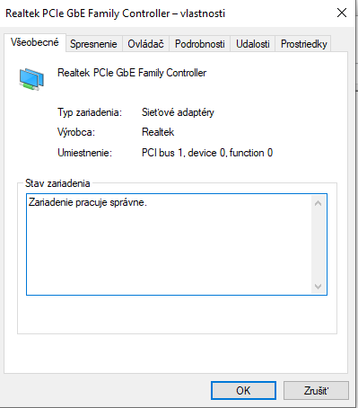
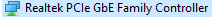
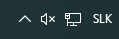

# Ú1: Diagnostika – nájdi a oprav problém

## Zakážte sieťový adaptér:](image.png)](image.png)

## Funguje internet? 
Nie

## Diagnostikujte problém:

 ## Overte, že ikona je opäť normálna: 

 ## Overte, že internet opäť funguje: 
 

# Ú2: Správa diskov – práca s diskmgmt.msc

| Údaj                          | Hodnota |
|--------------------------------|----------|
| Počet fyzických diskov        | 1 |
| Typ rozdelenia (MBR/GPT)      | MBR |
| Celková kapacita Disku 0      | 465,8 |
| Počet partícií na Disku 0     | 3 |
| Súborový systém na C:         | NTFS |
| Voľné miesto na C:            | 389,88 |
